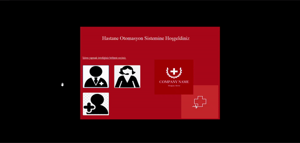
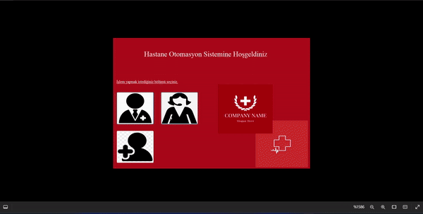

# Hospital Management System

This project is a software designed to manage daily operations of a hospital. It's aimed to facilitate operations for patients, doctors, and secretaries.


## Features

- **Doctors**: Doctors can view their appointments, create and edit medical records of patients.
- **Patients**: Patients can schedule appointments, select their doctors, and view their medical histories.
- **Secretaries**: Secretaries can manage appointments, update doctor and patient information.

## Installation

1. Clone the repository:

```bash
git clone https://github.com/user/hospital-management-system.git
```
Open the project in Visual Studio.

Update the SQL Server connection string in the app.config file.

Build and run the project.


Certainly! Here's the README content in Markdown format:

markdown
Copy code
# Hospital Management System

This project is a software designed to manage daily operations of a hospital. It's aimed to facilitate operations for patients, doctors, and secretaries.




## Features

- **Doctors**: Doctors can view their appointments, create and edit medical records of patients.
- **Patients**: Patients can schedule appointments, select their doctors, and view their medical histories.
- **Secretaries**: Secretaries can manage appointments, update doctor and patient information.

## Installation

1. Clone the repository:

```bash
git clone https://github.com/user/hospital-management-system.git
```
2. Open the project in Visual Studio.

3. Update the SQL Server connection string in the app.config file.

4. Build and run the project.

## Usage
Doctor Login: Use the "FrmDoctorLogin" form for doctors to log in.
Patient Login: Use the "FrmPatientLogin" form for patients to log in.
Secretary Login: Use the "FrmSecretaryLogin" form for secretaries to log in.

## Contributing
If you would like to contribute, please submit a pull request. Your contributions are welcome!